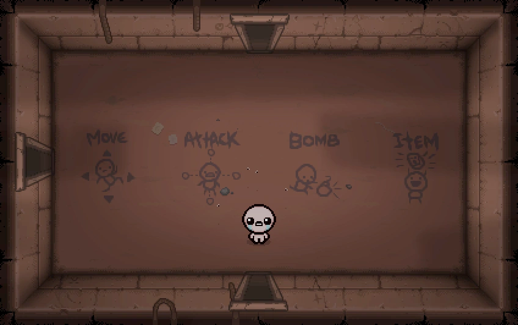

# PROYECTO HABICHUELAS RADIOACTIVAS - Bean a Hero

### Criterios de evaluación:
- 2 niveles mínimo.
- Un NPC.
- Mecánicas varias
- Editor de mapa (Tiled)
- Menú de inicio, recorrido, salida.

### Historia Introductoria:
La historia se remonta a una época distante, una época con diversos problemas, unos mas serios que otros. Siendo uno de los mas importantes la carencia de alimentos que sufrían en las regiones de la época, la época medieval...
Muchos habitantes y poco suministro de alimento para la gran cantidad de población que vivían en los pueblos de estos reinos antiguos. La gente desesperada, comenzaba a consumir cualquier tipo de alimento que encontraban, pero lo que no sabían era que el poco alimento disponible estaba contaminado con una especie de químico que volvía loca a la gente y los obligaba a actuar en contra de su voluntad. Los números de gente afectada fueron aumentando rápidamente ocasionando un desastre total.
La única esperanza de acabar con esta catástrofe era un caballero debilucho que nunca destaco entre los demás, pero ¿cómo podía este escuálido caballero salvar al mundo? La respuesta era sencilla, con el poder de las ¡Habichuelas Radioactivas! Unas extrañas habichuelas que poseían propiedades únicas ¿Qué tipo de propiedades? Ya lo descubrirán.
Y así comienza la aventura del caballero con sus objetivos muy claros, derrotar a los infectados y ya de paso acabar con el hambre del mundo restaurando las principales fuentes de comida ¿Sera capaz de lograrlo?

### Juego de salas:
- Temática: Medieval.
- Sala de inicio: Se explica la historia, las reglas y controles, se encuentra la 
primera habichuela otorgada (Un total de 2 habichuelas en el juego base) por el NPC.
- Por oleadas (Niveles)
- Primer nivel: 3 oleadas, siendo la tercera la del jefe (Segunda habichuela al
derrotar al jefe)
- Segundo nivel: 5 oleadas, 5 el jefe (Fin del juego). o Pierdes = Game Over.

### Tipos de enemigos.
- Cuerpo a Cuerpo.
- Distancia.
- Maquina de estados para los jefes.
- Jefe primero: Cuerpo a cuerpo y distancia.
- Jefe Segundo: Cuerpo a cuerpo y distancia (Parecido al primero, pero
mejorado) (Posibilidad de Mr. Bean).
### Personaje principal.
- Comenzamos como un pueblerino y se convierte en caballero luego de
recibir la primera habichuela.
- Movimientos: Esquive (Dash o Roll), Ataque de espada, Habilidad de
Habichuela (Especificado en sección Poder de las Habichuelas).
### Poder de las Habichuelas:
- Habichuela 1: Aumento de fuerza (Conversión a Caballero)
- Habichuela 2: Aumento de velocidad general (Estamina) (Utilizable con
tiempo de recarga).
 
### NPC
- Mr. Bean (Posibilidad).
### Menú de inicio:
- Botón de Start.
- Botón de salida.
### Menú de pausa.